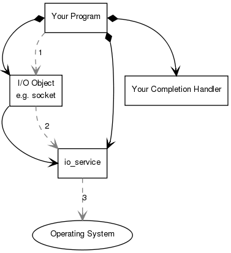
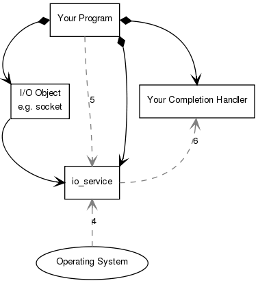

### 기본 Boost.Asio 구조

Boost.Asio는 소켓과 같은 IO 오브젝트에서 동기와 비동기 작업을 수행하는 데 사용될 수 있다. Boost.Asio를 사용하기 전에 Boost.Asio의 다양한 부분에 대한 개념적 그림과 프로그램 및 이들이 어떻게 작동하는지를 파악하는 것이 유용할 수 있습니다.

소개 예제로, 소켓에서 연결 작업을 수행할 때 어떤 일이 일어나는지 생각해 봅시다. 동기 작업을 예로 들어보겠습니다.

<kbd>
      
    </kbd>

프로그램에는 하나 이상의 io_service 객체가 있습니다. io_service는 운영체제의 I/O 서비스에 대한 프로그램의 링크를 나타냅니다.
~~~cpp
boost::asio::io_service io_service;
~~~
I/O 작업을 수행하려면 프로그램에 TCP 소켓과 같은 I/O 객체가 필요합니다.
~~~cpp
boost::asio::ip::tcp::socket socket(io_service);
~~~
동기 연결 작업이 수행되면 다음과 같은 일련의 이벤트가 발생합니다.

1. 프로그램이 I/O 객체를 호출하여 연결 작업을 시작합니다.
   ~~~cpp
   socket.connect(server_endpoint);  
   ~~~
2. I/O 객체는 요청을 io_service로 전달합니다.
3. io_service는 연결 작업을 수행하기 위해 운영체제를 호출합니다.
4. 운영체제는 작업 결과를 io_service에 반환합니다.
5. io_service는 작업 결과로 발생하는 모든 오류를 boost::system::error_code 유형의 객체로 변환합니다. error_code는 특정 값과 비교되거나 bool 값으로 판단됩니다.(false는 오류가 발생하지 않았음을 나타냄). 그런 다음 결과가 I/O 객체로 다시 전달됩니다.
6. 작업을 실패하면 I/O 객체는 boost::system::system_error 유형의 예외를 throw 합니다. 작업을 초기화하는 코드가 다음과 같이 작성된 경우
   ~~~cpp
   boost::system::error_code ec;
   socket.connect(server_endpoint, ec);
   ~~~
   error_code 변수 ec는 연산의 결과로 설정될 것이고, 예외는 던지지 않을 것입니다.

비동기 작업이 수행되면, 다른 일련의 이벤트가 발생합니다.

<kbd>
      
    </kbd>

1. 프로그램이 I/O 객체를 호출하여 연결 작업을 시작합니다.
   ~~~cpp
   socket.async_connect(server_endpoint, your_completion_handler);
   ~~~
   여기서 your_completion_handler는 시그니처가 있는 함수이거나 함수 객체입니다.
   ~~~cpp
   void your_completion_handler(const boost::system::error_code& ec);
   ~~~
   요구되는 정확한 시그니처는 실행되는 비동기 작업에 따라 다릅니다. 참조 문서에는 각 작업에 적합한 양식이 나와 있습니다.
2. I/O 객체는 요청을 io_service로 전달합니다.
3. io_service는 운영체제에게 비동기 연결을 시작해야 하는 신호를 보냅니다.

시간이 지남. (동기 연결 방식의 경우, 이 기다림은 접속 연결 기간에 포함되었을 것이다.)

<kbd>
      
    </kbd>

4. 운영체제는 결과를 대기 열에 배치하여 연결 작업이 완료되었음을 나타냅니다. io_service에서 작업을 수행할 준비가 되었습니다.
5. 프로그램은 io_service::run() (또는 유사한 io_service 멤버 함수 중 하나)을 호출하여 결과를 검색해야 합니다. 완료되지 않은 비동기 작업이 있는 동안 io_service::run()을 호출하면 첫 번째 비동기 작업을 시작하자마자 호출합니다.
6. io_service::run()을 호출하는 동안 io_service는 작업 결과를 대기 열에서 제거하고 error_code로 변환 한 다음 completion handler로 전달합니다.

[참조]
* http://www.boost.org/doc/libs/1_65_1/doc/html/boost_asio/overview/core/basics.html