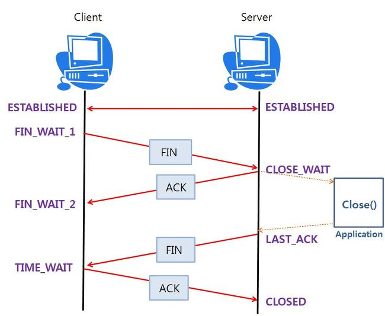

# TCP 연결 종료와 비정상 종료

* ### 4 way handshake를 통한 TCP 연결 종료

    TCP 연결을 위해 3 way Handshake를 통해 ESTABLISHED 하는 것과 달리 서로의 연결을 종료할 때는 4 way HandShake를 수행한다.

    클라이언트가 서버에게 종료 메시지를 보내는 경우를 가정해 보자

    
    
<kbd>
      
    </kbd>

    * 통신을 종료하고자 하는 Client가 서버에게 **FIN** 패킷을 보내고 자신은 **FIN_WAIT_1** 상태로 대기한다.
    * **FIN** 패킷을 받은 서버는 해당 포트를 **CLOSE_WAIT**으로 바꾸고 잘 받았다는 **ACK**를 Client에게 전한다. **ACK**를 받은 Client는 상태를 **FIN_WAIT_2**로 변경한다.
    * Close() 요청을 받은 Application은 종료 프로세스를 진행시켜 최종적으로 close()가 되고 server는 **FIN** 패킷을 Client에게 전송 후 자신은 **LAST_ACK**로 상태를 바꾼다.
    * **FIN_WAIT_2**에서 Server가 연결을 종료했다는 신호를 기다리다가 **FIN**을 받았다는 **ACK**를 Server에 전송하고 자신은 **TIME_WAIT**으로 상태를 바꾼다. (**TIME_WAIT**에서 일정 시간이 지나면 **CLOSED** 되게 된다.) 최종 ACK를 받은 서버는 자신의 포트도 **CLOSED**로 닫게 된다.

* ### 비정상 종료 상황

    따라서 다양한 상황에 따른 연결의 종료를 적절하게 처리하지 못하면, **FIN_WAIT_1**, **FIN_WAIT_2**, **CLOSE_WAIT** 상태로 남아 계속 기다리는 상황이 올 수 있다.

    * **CLOSE_WAIT** 상태 : Application에서 close()를 적절하게 처리해주지 못하면, TCP 포트는 **CLOSE_WAIT** 상태로 계속 기다리게 된다. 이렇게 **CLOSE_WAIT** 상태가 statement에 많아지게 되면, Hang이 걸려 더 이상 연결을 하지 못하는 경우가 생기기도 한다. 따라서 Application 개발 시 여러 상황에 따라 close() 처리를 잘 해줘야 한다.
    * **FIN_WAIT_1** 상태 : **FIN_WAIT_1** 상태라는 것은 상대방 측에 커넥션 종료 요청을 했는데, **ACK**를 받지 못한 상태로 기다리고 있는 것이다. (**FIN_WAIT_1**의 상태는 일정 시간이 지나 Time Out이 되면 자동으로 닫는다.)
    * **FIN_WAIT_2** 상태 : **FIN_WAIT_2** 상태는 클라이언트가 서버에 종료를 요청한 후 서버에서 요청을 접수했다고 **ACK**를 받았지만, 서버에서 종료를 완료했다는 **FIN**을 받지 못하고 기다리고 있는 상태이다. 이 상태는 양방에 두 번의 통신이 이루어졌기 때문에 네트워크의 문제는 아닌 것으로 판단되며, (**FIN**을 보내는 순간에 순단이 있어 못 받은 것일 수도 있다.) 서버 측에서 **CLOSE**를 처리하지 못하는 경우일 수도 있다. **FIN_WAIT_2** 역시 일정 시간 후 Time Out이 되면 스스로 Closed 하게 된다.
    * 어떠한 이유에서 **FIN_WAIT_1**과 **FIN_WAIT_2** 상태인 연결이 많이 남아있다면, 문제가 발생할 수 있다. 물론 일정 시간이 지나 Time Out이 되면 연결이 자동으로 종료되긴 하지만, 이 Time Out이 길어서 많은 수의 소켓이 늘어난다면, 메모리 부족으로 더 이상 소켓을 오픈하지 못하는 경우가 발생한다.
    * 이러한 문제 해결을 위해서 **FIN_WAIT_1**과 **FIN_WAIT_2**의 Time Out 시간을 적절히 조절할 필요가 있다.

* ### CLOSE_WAIT & TIME_WAIT

    TCP 소켓에는 총 11가지 상태가 있다 

    * CLOSED
    * LISTEN
    * SYN_SENT 
    * SYN_RECV
    * ESTABLISHED
    * CLOSE_WAIT
    * LAST_ACK
    * FIN_WAIT1
    * FIN_WAIT2
    * CLOSING
    * TIME_WAIT

    Active Close를 하는 쪽(close() 함수를 호출한 쪽)은 **TIME_WAIT** 상태가 되며, Passive Close를 하는 쪽(**FIN**을 수신한 쪽)은 **CLOSE_WAIT** 상태가 된다.

    * **TIME_WAIT 상태**

      * TCP의 **TIME_WAIT**는 TCP 연결을 종료할 때 신뢰성을 높이기 위해 존재하는 것으로 자연스럽게 발생하는 상태이다.
      * 만약 종료 절차가 잘못 진행되어 서버 쪽에 **TIME_WAIT** 상태가 남게 되면 심각한 문제가 발생할 수 있다. 일단 **TIME_WAIT**가 시작되면 2분여 이상 상태가 지속되게 되는데 모든 클라이언트들의 세션 종료 시마다 서버 측에 **TIME_WAIT**가 발생한다면, 서버 측 부하가 될 뿐만 아니라 최악의 경우 서버에서 더 이상 새로운 연결을 받아들일 수 없는 상황이 발생할 수 있다.
      * Active Close 하는 쪽의 마지막 **ACK**가 소실되었을 때, Passive Close 하는 쪽은 자신이 보낸 **FIN**에 대한 응답을 받지 못했으므로 **FIN**을 재전송한다. 이때 TCP는 connection 정보(주소와 포트)를 유지하고 있고, 이런 이유로 RST(에러라고 처리되는 세그먼트) 대신 **ACK**를 다시 보낼 수가 있다.
      * 확률이 극도로 희박하긴 하지만 네트워크를 방황하던 Passive Close 하는 쪽에서 보낸 중복된 **FIN** 메시지가 나중에 다시 생긴 connection에 영향을 주는 것을 방지하기 위해서 **TIME_WAIT** 상태를 2MSL 동안 유지한다.

    * **CLOSE_WAIT 상태** 

      * **CLOSE_WAIT**는 Passive Close 하는 쪽(**FIN**)에서 프로그램이 소켓을 종료 시키는 것을 기다리기 위한 상태이다. 프로그래밍 관점에서 말하면, recv byte가 0으로 연결이 끊어졌으나 close() 함수가 호출되지 않은 상태라고 생각하면 된다.
      * TCP connection은 close() 함수가 명시적으로 호출되지 않으면 **CLOSE_WAIT** 상태에서 영원히 멈춰 있을 수 있고 이것은 자원 누수로 이어진다.

* ### SO_LINGER

     * **SO_LINGER** 옵션을 어떤 특정한 방식으로 설정하면, 이후 소켓의 종료 방식이 바뀌고, 종료 방식의 차이로 인하여 결과적으로 **TIME_WAIT** 상태가 일어나지 않는다.

     * 옵션 설정 방법 (C++)

        ~~~cpp
        struct linger ling;
        ling.l_onoff = 1;   // linter 옵션을 끌 것인지, 킬 것인지 결정
        ling.l_linger = 0;  // 기다리는 시간의 결정
        setsockopt(socket, SOL_SOCKET, SO_LINGER, &linger, sizeof(ling));
        ~~~

        * **l_onoff == 0**

            **l_linger**의 영향을 받지 않는다. 소켓의 기본 설정으로 소켓 버퍼에 남아있는 모든 데이터를 보낸다. 이때 close()는 바로 리턴을 하게 되므로 백그라운드에서 이러한 일이 일어나게 된다. **Greateful Shutdown**을 보장한다.

        * **l_linger > 0**

            **l_linger**가 0보다 큰 양수이면, 해당 값의 시간 동안 커널은 **Greateful Shutdown**을 하려고 노력한다. (즉 자신의 버퍼를 해당 시간 내에 비우고, **FIN_ACK_FIN_ACK** 종료를 하기 위해 노력한다.)

            그리고 그 시간 동안 유저는 **1)** 자기가 만든 소켓이 블로킹 소켓이라면 close 작업에 블로킹 된 상태로 시간이 끝나거나 **Greateful Shutdown**이 될 때까지 기다려야 하고, **2)** 논 블로킹 소켓이라면 **EWOULDBLOCK** 에러 메시지만 받고 바로 커널의 리턴을 받아 다음 작업을 할 수 있다.

            만약 해당 시간 내에 **Greateful Shutdown**을 못하면, 커널은 **RST**(리셋 플래그)를 세팅해서 보내버린다. 만약 커널의 버퍼에 못 보낸 TCP 데이터가 있다고 하더라도, 그것은 모두 버린다. 리셋을 보낸 이후, 상대방 쪽에서 내 소켓에 뭔가 읽거나 쓰려고 해도, 상대는 **ECONNRESET** 에러만 받게 될 것이다.            

        * **l_linger** = 0

            **l_linger**가 0일 경우 아예 우아한 종료를 시도하지 않는다. 처음부터 커널은 자기 버퍼의 데이터를 모두 버리고, 상대방에게는 **RST** 플래그를 세팅해서 보낸다.

    * 이 방법의 경우 Client가 **RST** 신호에 대해 제대로 처리하지 못하면 Client가 Hang에 걸리는 현상 및 Client가 Socket의 단절에 대하여 민감하게 반응하는 어플의 경우에는 상태 응답을 제대로 처리하지 않았을 때 Client에서 위험할 수 있다.

* ###  SO_REUSEADDR 

    TCP 서버의 프로그램을 종료한 후 바로 다시 서버를 가동하면 bind에서 에러(Address already in use)로 끝날 때가 있다.

    **TIME_WAIT** 상태에서는 같은 포트를 다른 프로세스가 이용하는 것을 막도록 TCP 규격으로 규정되어있다. **TIME_WAIT** 상태의 포트와 동일한 포트를 bind 하려 하면 실패한다.

    단 끝나버린 프로세스가 쓰고 있는 포트 번호를 바로 쓸 수 없으면 곤란하므로 **TIME_WAIT** 상태로 남아있는 TCP 세션이 있더라도 bind 할 수 있는 방법이 있다. 그 방법이 **SO_REUSEADDR**을 사용하는 것이다.

    ~~~cpp
    int option = 1;
    setsockopt(socket, SOL_SOCKET, SO_REUSEADDR, (char*)&option, sizeof(option));
    ~~~

[참조]

* http://hyeonstorage.tistory.com/287
* http://kukuta.tistory.com/155
* http://www.sysnet.pe.kr/Default.aspx?mode=2&sub=0&detail=1&pageno=0&wid=1334&rssMode=1&wtype=0
* http://egloos.zum.com/rucaus/v/2372401
* http://wwwi.tistory.com/68
* https://www.joinc.co.kr/w/Site/Network_Programing/AdvancedComm/SocketOption