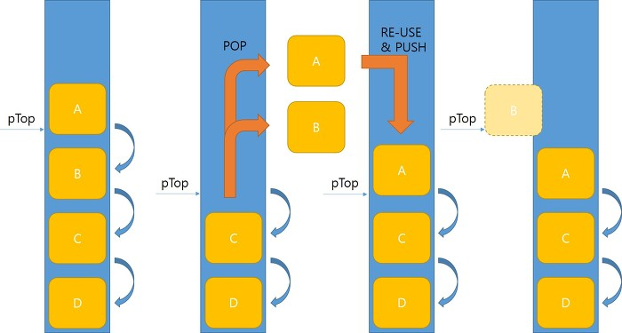

# Non-Blocking Algorithm

* ### Wait-Free
    Wait-Free는 Starvation-Free와 함께, 보장된 시스템 전체의 처리량을 갖춘 가장 강력한 Non-Blocking 알고리즘입니다.
    어떤 알고리즘의 모든 연산이 완료될 때까지 밟는 단계가 유한한 경우 Wait-Free이다.
    이 특징은 실시간 시스템에 중요하며 성능 비용이 너무 높지 않은 한 항상 가지고 있는 것이 좋습니다.

    1980년대에 모든 알고리즘은 Wait-Free로 구현될 수 있었고, 일반적인 구조라고 불리는 일련의 코드로부터 많은 변화를 보여주었다.
    그러나 결과적으로 나온 성능은 기존의 Blocking 방식과도 상대가 되지 않았습니다.
    여러 논문이 일반적 구조의 성능은 향상시켰지만, 여전히 성능은 Blocking 방식에 미치지 못했습니다.

    몇몇 논문은 Wait-Free 알고리즘을 만드는 것에 대한 어려움을 조사했습니다.
    예를 들어 CAS와 LL/SC와 같은 널리 이용 가능한 원자 상태의 기초 요소들은, 메모리 비용이 쓰레드의 수에 비해 선형적으로 증가하지 않고는 공유 자원에 대한 Starvation-Free 실행을 제공하지 못한다는 것이 밝혀졌습니다.

    하지만 실제로 이러한 부분은 공유 자원에 대한 각 쓰레드 당 저장소의 캐시 라인 혹은 exclusive reservation granule(ERG)은 실제 시스템에서 너무 비싸게 여겨지지 않기 때문에 실제 장벽으로써 나타나지 않습니다.
    (일반적으로, 논리적으로 필요한 저장소의 크기는 word이지만, 물리적으로 동일한 캐시 라인의 CAS 작업은 충돌하고 동일한 exclusive reservation granule의 LL/SC 작업이 충돌하므로 물리적으로 필요한 저장소의 양이 더 많습니다.)

    Wait-Free 알고리즘은 연구에서도, 실제로도 희귀한 알고리즘이었습니다. 그러나 2011년 Kogan과 Petrank는 공통의 하드웨어에서 일반적으로 사용할 수 있는 CAS 요소로 만들어진 Wait-Free Queue를 공개했습니다.
    그들의 구성은 Michael과 Scott의 Lock-Free Queue를 확장 시켰는데, 이것은 실제로 사용되는 효율적인 Queue입니다.
    Kogan과 Petrank의 후속 논문은 Wait-Free 알고리즘을 빠르게 만드는 방법을 제공했고 이 방법을 사용하여 Lock-Free Queue 만큼 빠른 Wait-Free Queue를 만들었습니다.
    Timnat과 Petrank의 후속 논문에서는 Lock-Free로부터 Wait-Free 데이터 구조를 생성하는 자동 메커니즘을 제공했습니다. 따라서, 현재 많은 데이터 구조에서 Wait-Free 구조를 사용할 수 있습니다.

* ### Lock-Free
    Lock-Free는 개별 쓰레드를 기아 상태에 빠지게 하지만, 시스템 전체 처리량을 보장합니다.
    긴 시간 동안 쓰레드가 실행될 때, 적어도 하나의 쓰레드가 진행을 하면, 이 알고리즘은 Lock-Free입니다. 모든 Wait-Free는 Lock-Free입니다.

    특히 한 쓰레드가 일시 중단된 경우, 잠금 없는 알고리즘으로 나머지 쓰레드가 계속 진행될 수 있습니다. 
    따라서 두 쓰레드가 동일한 mutex lock 또는 spinlock에 대해 경쟁하는 경우, 이 알고리즘은 Lock-Free가 아닙니다.

    만약 일부 프로세서에 의한 무한한 동작이 유한한 수의 단계에서 성공한다면 이 알고리즘은 Lock-Free입니다.
    예를 들어, N 개의 프로세서가 하나의 동작을 실행하려고 한다면, 그중 일부는 유한한 수의 단계에서 연산을 완료하고 나머지는 실패할 수 있으며 다시 시도할 수 있습니다.
    Wait-Free와 Lock-Free의 차이점은, 각 프로세스의 Wait-Free 작업이 유한한 수의 단계에서 성공할 수 있다는 것입니다.

    일반적으로, Lock-Free 알고리즘은 네 가지 단계로 실행될 수 있습니다. 
    
    1) 작업 완료 
    2) 작업 차단 지원
    3) 작업 차단 중단
    4) 대기

    작업을 완료하는 것은 동시적인 지원, 중단의 가능성에 따라 복잡하지만, 완료까지 가장 빠른 길입니다.

    작업 차단의 경우에 직면했을 때 지원, 중단, 대기에 대한 경쟁을 관리하는 쪽의 책임입니다.
    이는 매우 간단할 수도 있고, 더 나은 처리 결과를 얻거나 우선순위가 지정된 작업의 대기 시간을 줄이기 위해 더 최적화될 수 있습니다.

    정확한 동시 지원은 일반적으로 Lock-Free 알고리즘의 가장 복잡한 부분이며, 실행 비용이 많이 든다.
    지원해주는 쓰레드가 느려질 뿐만 아니라, 공유 메모리의 메커니즘으로 인해 도움을 받는 쓰레드도 느려질 것이다.

    ----

    여러개의 쓰레드에서 동시에 작업이 호출되었을 경우 정해진 시간마다 적어도 한 개의 알고리즘 호출이 완료되는 알고리즘. Lock-Free는 적어도 1개는 무조건 실행이 되고 있어야한다.

    Lock-Free에는 Wait-Free와 Wait-Free가 아닌 알고리즘이 존재한다. Lock-Free라고 해서 Wait-Free는 아니다. Wait-Free는 Lock-Free 알고리즘이다.

    Non-Blocking을 구현하기 위해서는 대부분의 알고리즘에 CAS가 필요하다. enqueue, push, insert 등등..
    CAS가 있으면 모든 싱글 쓰레드 알고리즘을 Lock-Free 알고리즘으로 구현할 수 있다.

    ~~~cpp
    CAS(&a, old, new)
    ~~~

    a 메모리 값이 old이면 new로 바꾸고 old가 아니라면 아무것도 하지 말아라.
    다시 말해서 a 메모리를 다른 쓰레드가 건드려서 false가 나오면 아무것도 하지 말라는 뜻이다.

    ----

    Non-Blocking 알고리즘에는 등급이 있다. 가장 이상적인 것은 전체 쓰레드가 공유 자원을 일관적으로 사용하면서도 대기하지 않고 그냥 진행되는 것이다.
    이것을 Wait-Free 수준의 알고리즘이라고 한다. 하지만 Wait-Free를 제대로 구현하려면 많은 제약이 따른다. 그래서 매우 한정적인 상황에서만 Wait-Free 알고리즘을 적용할 수 있다.
    일반적인 경우 Lock-Free 수준의 알고리즘을 사용한다. 항상 하나 이상의 자원이 유한한 단계에 획득되어서 그 사용을 끝마친다.
    어떤 쓰레드가 자원을 획득할지 결정적이지 않으므로, 여전히 기아현상을 완전히 극복할 수는 없다.
    이보다 낮은 단계의 Obstruction-Free 수준이 있다. 한개를 제외하고 다른 모든 쓰레드를 대기시키면 대기 아닌 쓰레드가 자원을 획득하여 유한한 단계에 사용을 끝마칠 수 있다.
    충돌중인 쓰레드를 멈추게 해야한다는 점에서 진정 Non-Blocking이라고 부르기엔 문제가 있지 않은가 한다.

    Atomic 연산을 통해 Lock-Free를 구현한다. Windows에서 Atomic 연산들은 보통 Interlocked~로 제공된다. Atomic 연산은 실행이 한번에 완료되는 것을 보장하므로, 쓰레드 동기화 문제에서 쉽게 벗어날 수 있다.
    여러 atomic 연산이 있는데 그 중에 Lock-Free에 가져다 쓰기 가장 좋은 것이 CAS(Compare and -set/swap)이다.
    지금 쓰려고 하는 대상이 현재 쓰레드의 맥락에서 일관적이면, 변경을 가하고 그렇지 않으면 대기하지 않고 바뀐 상태로 쓰레드의 로컬 정보를 갱신한 뒤 다른 작업을 진행하는 것이다.
    
    Stack 자료구조에서 Push 하는 예제 코드를 보면 쉽게 이해할 수 있다.

    ~~~cpp
    void Push(Node* pNewNode)
    {
        do{
            // 이번 try의 top를 체크한다.
            Node* t = pTopNode;
            // 일단 새로 넣을 객체의 next를 이번 try의 top으로 놓고
            pNewNode->pNext = t;
        // 내가 아는 top이 지금도 top이면 pNewNode를 넣는다. 
        } while(!CAS(&pTopNode, t, pNewNode))
    }
    ~~~
    
    
<kbd>
      
    </kbd>

    

[참조]

* https://rein.kr/blog/archives/1346
* https://en.wikipedia.org/wiki/Non-blocking_algorithm
* http://true-bear.tistory.com/49
* http://ozt88.tistory.com/38