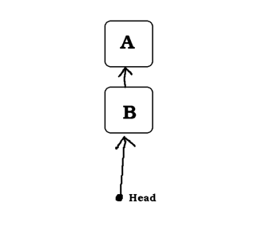
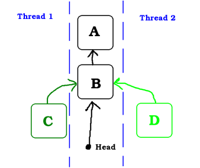
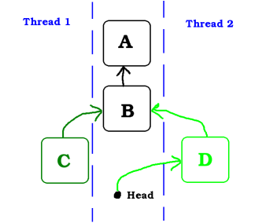
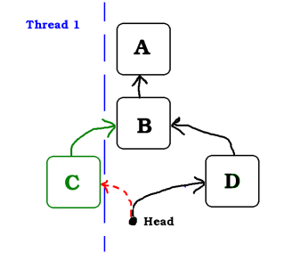
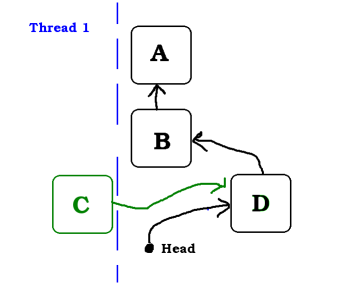
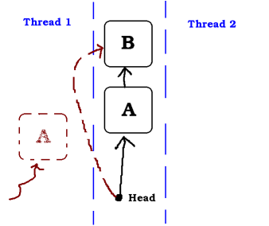
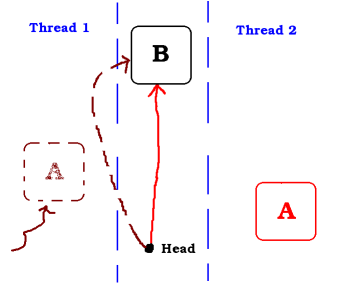
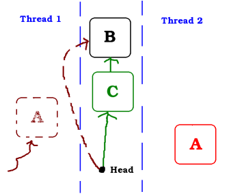
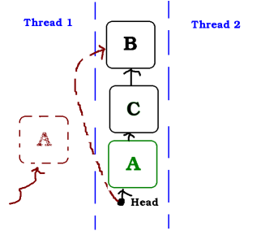
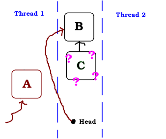

# Non-Blocking Algorithm

* ### Wait-Free
    Non-Blocking 알고리즘에 중 가장 이상적인 것은 전체 스레드가 공유 자원을 일관적으로 사용하면서도 대기하지 않고 그냥 진행되는 것입니다.
    이것을 Wait-Free 수준의 알고리즘이라고 합니다.  

    Wait-Free는 시스템 전체의 처리량을 보장해주는 가장 강력한 Non-Blocking 알고리즘입니다.
    이러한 특징은 실시간 시스템에 매우 중요하며, 성능상 처리 비용이 너무 높지 않은 한 항상 활용하는 것이 좋습니다.
    Wait-Free 데이터 구조는 데이터 구조에 액세스하는 모든 스레드가 다른 스레드의 동작과 관계없이 제한된 수의 단계 내에서 해당 연산을 완료할 수 있도록 하는 특성을 가진 Lock-Free 데이터 구조입니다.
    
    

    Wait-Free를 제대로 구현하려면 많은 제약이 따릅니다.
    그래서 매우 한정적인 상황에서만 Wait-Free 알고리즘을 적용할 수 있습니다.
    일반적인 경우 Lock-Free 수준의 알고리즘을 사용합니다.

* ### Lock-Free
    Lock-Free는 개별 스레드를 기아 상태에 빠지게 하지만, 시스템 전체 처리량을 보장합니다.
    긴 시간 동안 스레드가 실행될 때, 적어도 하나의 스레드가 진행을 하면 이 알고리즘은 Lock-Free입니다.
    특히 한 스레드가 일시 중단된 경우, Lock-Free 알고리즘은 나머지 스레드가 계속 진행될 수 있습니다.

    만약 일부 프로세서에 의한 무한한 동작이 유한한 수의 단계에서 성공한다면, 이 알고리즘은 Lock-Free입니다.
    예를 들어, N 개의 프로세서가 하나의 동작을 실행하려고 한다면, 그중 일부는 유한한 수의 단계에서 연산을 완료하고 나머지는 실패할 수 있으며, 다시 시도할 수 있습니다.
    Wait-Free와 Lock-Free의 차이점은, 각 프로세스의 Wait-Free 작업이 다른 프로세서와 관계없이 유한한 수의 단계에서 성공할 수 있다는 것입니다.

    Lock-Free에는 Wait-Free와 Wait-Free가 아닌 알고리즘이 존재합니다.
    Lock-Free라고 해서 Wait-Free는 아닙니다.
    Wait-Free는 Lock-Free 알고리즘입니다.

    여러 개의 스레드에서 동시에 작업이 호출되었을 경우 적어도 한 개의 알고리즘 호출이 완료되는 알고리즘입니다.
    적어도 한 개는 무조건 실행이 되고 있어야 합니다.

    한 데이터 구조를 Lock-Free로 규정하려면, 데이터 구조에 대한 연산을 수행하고 있는 스레드가 연산 도중 어느 포인트에서 중단됐을 때, 데이터 구조에 접근하는 다른 스레드들은 반드시 그들의 일을 끝낼 수 있어야 합니다.

    연산을 완료하는 것은 동시적인 지원, 중단의 가능성에 따라 복잡해집니다. 하지만, 가장 빠른 완료 방법입니다.

    작업이 차단됐을 때 지원, 중단, 대기는 경쟁 관리자의 책무입니다.
    이것은 매우 간단할 수도 있고, 더 나은 처리를 얻기 위해 최적화될 수도 있고, 우선순위가 지정된 작업의 대기 시간을 줄이기 위해 더 최적화될 수 있습니다.

    적절한 동시성 지원은 일반적으로 Lock-Free 알고리즘의 가장 복잡한 부분이며, 실행 비용이 많이 듭니다.
    지원해주는 스레드가 느려질 뿐만 아니라, 공유 메모리의 메커니즘 덕분에 보조 스레드가 실행 중에 느려질 수 있습니다.

    Lock-Free를 구현하기 위해 Atomic 연산을 해야 합니다.
    Atomic 연산은 실행이 한 번에 완료되는 것을 보장하므로, 스레드 동기화 문제에서 쉽게 벗어날 수 있습니다.
    여러 Atomic 연산이 있는데 그중에 CAS(Compare And Swap)가 있습니다.
    CAS가 있으면 모든 싱글 스레드 알고리즘을 Lock-Free 알고리즘으로 구현할 수 있습니다.

    ~~~cpp
    CAS(&a, old_value, new_value);
    ~~~

    a 메모리 값이 old_vaule 이면 new_value로 바꾸고 old_value가 아니라면 아무것도 하지 않는 기능의 함수입니다.
    다시 말해서 a 메모리를 다른 스레드가 건드려서 false가 나오면 아무것도 하지 않는다는 뜻입니다.

    항상 하나 이상의 자원이 유한한 단계에 획득되어 연산을 끝마칩니다.
    어떤 스레드가 자원을 획득할지 결정적이지 않으므로 여전히 기아 현상을 완전히 극복할 수는 없습니다.

    만약 여러 스레드가 동일한 데이터를 수정하려고 하고, 서로 재시도를 하게 하는 Lock-Free 데이터 구조를 사용한다면 스레드가 서로의 진행을 방해하므로 여러 스레드에서 높은 액세스 속도로 인해 성능이 심각하게 저하될 수 있습니다.
    이것이 Wait-Free 데이터 구조가 중요한 이유입니다.

* ### Lock-Free 구현

    ~~~cpp
    void Push(Node* pNewNode)
    {
        do {
            // 이번 try의 top을 체크합니다.
            Node* t = pTopNode;     // (1)
            // 일단 새로 넣을 객체의 Next를 이번 try의 top으로 놓고
            pNewNode->pNext = t;    // (2)
        // 내가 아는 top이 지금도 top이라면 pNewNode를 넣습니다.
        } while(!CAS(&pTopNode, t, pNewNode))   // (3)
    }
    ~~~

    * 각 노드는 다음 노드에 대한 포인터를 가지며, head라는 첫 번째 노드에 대한 포인터를 갖습니다.
        
<kbd>
            
        </kbd>

    * 이 예에서 두 개의 스레드는 노드를 Push 하려고 합니다. 두 스레드는 이미 (2) 줄까지 실행했으며, 이전 헤드인 B에서 C 또는 D로 변경하기 위한 원자 연산을 시작합니다.
        
<kbd>
            
        </kbd>

    * 이 이미지에서 스레드 2의 연산이 먼저임을 알 수 있습니다. 연산 결과로 D가 스택으로 Push 되었습니다.
        
<kbd>
            
        </kbd>

    * Head가 더 이상 B가 아니기 때문에, 스레드 1의 CAS 연산은 실패합니다. Head는 변경되지 않고 여전히 D가 스택에 있습니다.
        
<kbd>
            
        </kbd>

    * 스레드 1은 CAS에 실패하고 다시 D를 Head로 지정해 시도한다.
        
<kbd>
            
        </kbd>

* ### ABA 문제
  
    * 스레드 1은 노드를 pop 하려고 합니다. A의 주소를 가진 후 head를 A에서 B로 변경하기 위한 CAS를 수행하려고 합니다. 그러나 CAS를 실행하기 직전에 OS에 의해 Context Switching이 되어 스레드 2의 실행 순서가 되었다고 가정합니다.
        
<kbd>
            
        </kbd>

    * 스레드 1이 Sleep 상태인 동안, 스레드 2도 노드를 pop하므로 A는 더 이상 스택에 없습니다. 스레드 1이 깨어나면, head가 A와 더 이상 같지 않기 때문에 스레드 1의 CAS 연산은 실패합니다. 그러나 스레드 1은 깨어나지 않고, 스레드 2가 계속 진행된다고 가정합니다.
        
<kbd>
            
        </kbd>

    * 스레드 2가 C를 push 합니다. 아직도 스레드 1이 깨어나면 문제가 없지만, 여전히 스레드 2가 실행되고 있다고 가정합니다.
        
<kbd>
            
        </kbd>

    * 그리고 스레드 2가 A를 push 합니다.
        
<kbd>
            
        </kbd>

    * 이 상황에서 스레드 1이 깨어나 CAS를 실행합니다. head는 여전히 A이기 때문에 연산이 성공합니다. 결과적으로 head는 B를 가리키기 때문에 C의 데이터가 유실됩니다.
        
<kbd>
            
        </kbd>
 

# Non-Blocking Algorithm

* ### Wait-Free
    1980년대에 모든 알고리즘은 Wait-Free로 구현될 수 있었고, 일반적인 구조라고 불리는 일련의 코드로부터 많은 변화를 보여주었다.
    그러나 결과적으로 나온 성능은 기존의 Blocking 방식과도 상대가 되지 않았습니다.
    여러 논문이 일반적 구조의 성능은 향상시켰지만, 여전히 성능은 Blocking 방식에 미치지 못했습니다.

    몇몇 논문은 Wait-Free 알고리즘을 만드는 것에 대한 어려움을 조사했습니다.
    예를 들어 CAS와 LL/SC와 같은 널리 이용 가능한 원자 상태의 기초 요소들은, 메모리 비용이 쓰레드의 수에 비해 선형적으로 증가하지 않고는 공유 자원에 대한 Starvation-Free 실행을 제공하지 못한다는 것이 밝혀졌습니다.

    하지만 실제로 이러한 부분은 공유 자원에 대한 각 쓰레드 당 저장소의 캐시 라인 혹은 exclusive reservation granule(ERG)은 실제 시스템에서 너무 비싸게 여겨지지 않기 때문에 실제 장벽으로써 나타나지 않습니다.
    (일반적으로, 논리적으로 필요한 저장소의 크기는 word이지만, 물리적으로 동일한 캐시 라인의 CAS 작업은 충돌하고 동일한 exclusive reservation granule의 LL/SC 작업이 충돌하므로 물리적으로 필요한 저장소의 양이 더 많습니다.)

    Wait-Free 알고리즘은 연구에서도, 실제로도 희귀한 알고리즘이었습니다. 그러나 2011년 Kogan과 Petrank는 공통의 하드웨어에서 일반적으로 사용할 수 있는 CAS 요소로 만들어진 Wait-Free Queue를 공개했습니다.
    그들의 구성은 Michael과 Scott의 Lock-Free Queue를 확장 시켰는데, 이것은 실제로 사용되는 효율적인 Queue입니다.
    Kogan과 Petrank의 후속 논문은 Wait-Free 알고리즘을 빠르게 만드는 방법을 제공했고 이 방법을 사용하여 Lock-Free Queue 만큼 빠른 Wait-Free Queue를 만들었습니다.
    Timnat과 Petrank의 후속 논문에서는 Lock-Free로부터 Wait-Free 데이터 구조를 생성하는 자동 메커니즘을 제공했습니다. 따라서, 현재 많은 데이터 구조에서 Wait-Free 구조를 사용할 수 있습니다.

* ### Lock-Free
    Lock-Free는 개별 쓰레드를 기아 상태에 빠지게 하지만, 시스템 전체 처리량을 보장합니다.
    긴 시간 동안 쓰레드가 실행될 때, 적어도 하나의 쓰레드가 진행을 하면, 이 알고리즘은 Lock-Free입니다. 모든 Wait-Free는 Lock-Free입니다.

    특히 한 쓰레드가 일시 중단된 경우, Lock-Free 알고리즘으로 나머지 쓰레드가 계속 진행될 수 있습니다. 
    따라서 두 쓰레드가 동일한 mutex lock 또는 spinlock에 대해 경쟁하는 경우, 이 알고리즘은 Lock-Free가 아닙니다.

    일반적으로, Lock-Free 알고리즘은 네 가지 단계로 실행될 수 있습니다. 
    
    1) 작업 완료 
    2) 작업 차단 지원
    3) 작업 차단 중단
    4) 대기

    ----

    이보다 낮은 단계의 Obstruction-Free 수준이 있다. 한개를 제외하고 다른 모든 쓰레드를 대기시키면 대기 아닌 쓰레드가 자원을 획득하여 유한한 단계에 사용을 끝마칠 수 있다.
    충돌중인 쓰레드를 멈추게 해야한다는 점에서 진정 Non-Blocking이라고 부르기엔 문제가 있지 않은가 한다.

    지금 쓰려고 하는 대상이 현재 쓰레드의 맥락에서 일관적이면, 변경을 가하고 그렇지 않으면 대기하지 않고 바뀐 상태로 쓰레드의 로컬 정보를 갱신한 뒤 다른 작업을 진행하는 것이다.
    
    Stack 자료구조에서 Push 하는 예제 코드를 보면 쉽게 이해할 수 있다.

    ~~~cpp
    void Push(Node* pNewNode)
    {
        do{
            // 이번 try의 top를 체크한다.
            Node* t = pTopNode;     // (1)
            // 일단 새로 넣을 객체의 next를 이번 try의 top으로 놓고
            pNewNode->pNext = t;    // (2)
        // 내가 아는 top이 지금도 top이면 pNewNode를 넣는다. 
        } while(!CAS(&pTopNode, t, pNewNode))   // (3)
    }
    ~~~

    사실 위 예제는 사용할 수 있는 코드가 아니다. ABA라고 불리는 문제 때문이다.

    ----

    * Non-Blocking
    
        Non-Blocking 기능은 Blocking을 하지 않는 것입니다.
        Non-Blocking 데이터 구조는 모든 작업이 Non-Blocking 구조입니다.
        모든 Lock-Free 데이터 구조는 본질적으로 Non-Blocking입니다.

        Spin-Lock은 Non-Blocking 동기화의 한 예입니다.
        하나의 쓰레드에 잠금이 있으면 대기중인 쓰레드는 일시 중단 되기 않지만 잠금을 보유한 쓰레드가 잠금을 해제할 때 까지 루프 해야합니다.

        Spin-Lock 루프와 Busy-Wait 등 다른 알고리즘은 Lock-Free가 아닙니다.
        왜냐하면, 만약 한 쓰레드(잠금을 유지하는 쓰레드)가 일시 중단되면 아무 쓰레드도 진행할 수 없기 때문이다.

    * Lock-Free
    
        Lock-Free 데이터 구조는 뮤텍스 잠금을 사용하지 않는 구조입니다.
        그 의미는 잠금이 없어도 여러 쓰레드가 경쟁 조건이나 데이터 손상 없이 동시에 데이터 구조에 엑세스 할 수 있다는 것입니다.
        하나 이상의 쓰레드가 동시에 Lock-Free 데이터 구조에 안전하게 엑세스 할 수 있다고 해서, 그러한 엑세스에 대한 제한이 없다는 것을 의미하지는 않습니다.

        예를 들어 Lock-Free Queue는 다른 쓰레드가 새로운 값을 추가할 때 다른 쓰레드가 값을 제거하는 것을 허락한다. 반면 새로운 값을 동시에 추가하는 다중 쓰레드는 잠재적으로 데이터 손상을 일으킬 수 있습니다.
        데이터 구조 설명은 어떤 연산의 조합이 안전하게 동시에 호출 될 수 있는 지를 나타냅니다.
        
        이것은 Spin-Lock이나 다른 Busy-Wait 메커니즘을 사용하는 Non-Blocking 데이터 구조와는 구별되는 근본적인 규약 사항입니다.

        단지 데이터 구조가 Lock-Free이기 때문에 쓰레드가 기다릴 필요가 없다는 것을 의미하는 것은 아닙니다.
        만약 작업이 여러 단계로 걸린다면, 작업을 통해 OS가 부분적으로 선점할 수 있습니다.
        다시 시작하면 쓰레드가 작업을 다시 시작해야 할 수 있습니다.

        경우에 따라, 부분적으로 완료된 작업은 작업이 완료될 때 까지 다른 쓰레드가 원하는 작업을 데이터 구조에서 수행하는 것을 방지합니다.
        알고리즘이 Lock-Free이려면, 중단된 쓰레드의 부분 완료 연산을 중단하거나 완료해야합니다.
        일시 중단된 쓰레드가 스케줄러에 의해 깨워지면 재시도 하거나 적절하게 연산을 완료할 수 있습니다.
        Lock-Free 알고리즘에서 쓰레드는 경쟁이 심한 경우 무한번 연산을 재시도 해야한다는 것을 알아낼 수도 있습니다.

    * Wait-Free

        Wait-Free 데이터 구조는 데이터 구조에 엑세스 하는 모든 쓰레드가 다른 쓰레드의 동작과 관계없이 제한된 수의 단계 내에서 해당 연산을 완료할 수 있도록 하는 특성을 가진 Lock-Free 데이터 구조입니다.
        다른 쓰레드와의 충돌로 인해 무제한의 재시도를 할 수 있는 알고리즘은 Wait-Free가 아닙니다.
        이 속성은 데이터 구조에 엑세스 하는 우선순위가 높은 쓰레드가 우선순위가 낮은 쓰레드의 작업 완료를 기다릴 필요가 없으며, 모든 쓰레드는 OS에 의해 스케줄링을 받고있을 때 항상 진행할 수 있음을 의미합니다.
        실시간 또는 준실시간 시스템에서 이것은 필수적인 속성일 수 있습니다. 왜냐하면 Blocking 혹은 Non-Wait-Free Lock-Free 데이터 구조의 무제한 대기는 제한시간 내에 수행을 허락하지 않기 때문입니다.

        Wait-Free 데이터 구조의 단점은 Non-Wait-Free 데이터 구조보다 더 복잡하다는 것입니다.
        이것은 각 작업에 오버 헤드를 일으켜 Non-Wait-Free 데이터 구조보다 더 긴 수행시간이 걸릴 수 있습니다.

    

    Lock 기반의 데이터 구조는 가장 사용하기 쉽지만, 제한된 동시성이 있습니다. 저부하 상황에서는 가장 빠를 수 있습니다.

    Lock-Free(Wait-Free가 아닌) 데이터 구조는 더 많은 동시 엑세스를 허용할 수 있지만, 로드가 많은 경우에는 Busy-Wait 가능성이 있습니다.
    Lock-Free 데이터 구조는 구현하기 상당히 어려우며 추가 동시성으로 인해 프로그램 동작에 대한 추론이 어려워 질 수 있습니다.
    Lock-Based 데이터 구조보다 빠르지만 반드시 그런 것은 아닙니다.
    
    Wait-Free 데이터 구조는 동시 엑세스에 대한 최대 잠재력을 가지고 있습니다. 그러나 다른 Lock-Free 데이터 구조보다 훨씬 구현하기 어려우며 일반적으로 모든 엑세스에 추가 성능 비용이 들어갑니다.

    ----

    Non-Blocking 쓰레드 동기화 알고리즘에는 Lock-Free, Wait-Free 알고리즘이 있습니다.
    그들의 의미는 가끔씩 헷갈립니다.
    Lock-Free 시스템에서 특정 계산이 일정 기간동안 차단될 수 있지만, 모든 CPU는 다른 계산을 계속 수행할 수 있습니다.
    Lock-Free 알고리즘은 가끔 특정 트랜잭션의 대기 시간을 증가시킴으로써 시스템의 전체 처리량을 증가시킵니다.
    대부분의 high-end 데이터 베이스 시스템은 다양한 수준의 Lock-Free 알고리즘을 기반으로 합니다.

    반대로 Wait-Free 알고리즘은 모든 CPU가 효과적으로 작업을 계속 할 뿐만 아니라, 다른 연산을 통해 연산이 Blocking 될 수 없도록 합니다.
    Wait-Free 알고리즘은 Lock-Free 알고리즘보다 더 강력한 보장을 제공하며, 특정 트랜잭션의 대기 시간을 소모하지 않으면서 높은 처리량을 보장합니다.
    또한 구현, 테스트, 디버그가 훨씬 더 어렵습니다.

    시스템이 수십개의 동시 트랜잭션을 처리하고 유연한 대기시간 요구 사항이 있는 상황에서, Lock-Free 시스템은 개발 복잡성과 높은 동시성 요구 사항간의 좋은 절충안입니다.
    웹 사이트용 데이터베이스 서버는 Lock-Free 알고리즘 디자인을 위한 좋은 후보입니다.
    주어진 트랜잭션이 차단될 수는 있지만, 처리되는 트랜잭션은 항상 더 많으므로 CPU가 Idle 상태를 유지하지는 않습니다.
    문제는 적절한 대기시간과 적당한 표준편차를 유지하는 트랜잭션 스케줄러를 구축하는 것입니다.

    시스템이 대략적으로 CPU 코어만큼 많은 동시 트랜잭션을 처리하거나, 처리하기 어려운 실시간 요구 사항이 있는 경우, 개발자는 Wait-Free 시스템을 구축하기 위해 추가 시간을 할애해야합니다.

    ----
    
    Lock-Free 프로그램의 중요한 결과중 하나는 만약 한 단일 쓰레드가 일시 중단을 한다고 하더라도 쓰레드 각각의 Lock-Free 연산을 통해 그것이 절대 다른 쓰레드를 막지 않는 다는 것입니다.
    이것은 인터럽트 처리기 및 실시간 시스템을 작성할 때, Lock-Free 프로그래밍의 가치를 나타냅니다.
    프로그램의 나머지 상태가 무엇이든 특정 작업이 특정 시간 제한 내에 완료되어야 하는 실시간 시스템입니다.

    원자적 연산은 나눌 수 없는 방식으로 메모리를 조작하는 것입니다.
    쓰레드가 일을 반만 끝낸 것은 절대 볼 수 없습니다.

    Read-Modify-Write(RMW) 작업은 한단계 더 나아가 복잡한 트랜잭션을 자동으로 수행할 수 있게 해주비다.
    Lock-Free 알고리즘이 여러 작성자들을 지원해야할 때 매우 유용합니다.
    실제로는 한 줄씩 정렬하여 이러한 작업을 한번에 하나씩 실행하기 때문입니다.

    RMW 연산의 예로, Win32의 _InterlockedIncrement, iOS의 OSAtomicAdd32, c++11의 std::atomic\<int\>::fetch_add가 있습니다.

    c++ 11 원자 표준 구현이 모든 플랫폼에서 잠금 없이 수행된다는 것을 보장하지 않으므로, 플랫폼과 툴체인의 기능을 아는 것이 좋습니다.
    std::atomic\<\>::is_lock_free를 호출하여 확실히 확인할 수 있습니다.

    원자 RMW는 단일 프로세서 시스템에서도 Lock-Free 프로그래밍의 필수 요소입니다.
    원자성이 없으면 트랜잭션의 중간에 쓰레드가 인터럽트 되어 일관성이 없는 상태가 될 수 있습니다.

    가장 자주 논의되는 RWM 연산은 CAS(Compare-And-Swap)입니다. Win32에서 CAS는 _InterlockedCompareExchange와 같은 내장 함수 계열을 통해 제공됩니다.
    종종 프로그래머들은 트랜잭션을 반복적으로 시도하기 위해, 반복문에서 CAS를 수행합니다.
    이 패턴은 일반적으로 공유 변수를 로컬 변수에 복사하고, 가능성 있는 일(CAS가 성공했을 시 적용될 부분)을 수행하고, CAS를 사용하여 변경 사항을 적용하려고 합니다.

    ~~~cpp
    void LockFreeQueue::push(Node* newHead)
    {
        for(;;)
        {
            // Copy a shared variable (m_Head) to a local.
            Node* oldHead = m_Head;

            // Do some speculative works, not yet visible to other threads.
            newHead->next = oldHead;

            // Next, attempt to publish our changes to the shared variable.
            // If the shared variable hasn't changed, the CAS succeeds and we return.
            // Otherwise, repeat.
            if(_InterlockedCompareExchange(&m_Head, newHead, oldHead) == oldHead)
                return;
        }
    }
    ~~~

    이러한 루프는 여전히 하나의 쓰레드에 대해 테스트가 실패하면 다른 쓰레드에서 성공했다는 것을 의미하기 때문에 Lock-Free로 간주됩니다.
    CAS 루프를 구현할 때마다 ABA 문제를 피하기 위해 특별한 주의를 기울여야 합니다.

    Sequential consistency는 모든 쓰레드가 메모리 연산이 발생한 순서에 동의하며, 그 순서는 프로그램 소스 코드의 연산 순서와 일치함을 의미합니다.
    Sequential consistency 하에 메모리 재배열을 경험하는 것은 불가능합니다.

    Sequential consistency를 달성하는 간단한 방법은 컴파일러 최적화를 비활성화 하고 모든 쓰레드를 단일 프로세서에서 실행하도록 하는 것입니다.
    프로세서는 임의의 시간에 쓰레드를 선점하고 예약할 때에도 자체 메모리 효과를 알 수 없습니다.

    일부 프로그래밍 언어는 다중 프로세서 환경에서 실행되는 최적화 된 코드에 대해서도 순차적으로 일관성을 제공합니다.
    C\+\+11에서는 모든 공유 변수를 기본 메모리 순서 제약 조건을 가진 C\+\+11 원자 유형으로 선언할 수 있습니다.

    자바에서는 모든 공유 변수를 휘발성으로 표시할 수 있습니다.
    다음은 C++11 스타일로 다시 작성된 이전 게시물의 예제입니다.

    ~~~cpp
    std::atomic<int> X(0), Y(0);
    int r1, r2;

    void thread1()
    {
        X.store(1);
        r1 = Y.load();
    }

    void thread2()
    {
        Y.store(1);
        r2 = X.load();
    }
    ~~~

    C++11 Atomic은 sequential consistency를 보장하기 때문에 결과 r1 = r2 = 0은 불가능합니다.
    이를 달성하기 위해 컴파일러는 일반적으로 메모리 장벽 및 / 또는 RMW 작업과 관련된 추가 명령을 출력합니다.
    이러한 추가 명령어는 프로그래머가 메모리 순서를 직접 처리한 것과 비교하여 구현을 덜 효율적으로 만들 수 있습니다.

    멀티 코어에 대한 Lock-Free 프로그래밍을 수행할 때마다 환경이 sequential consistency를 보장하지 않으면, 메모리 순서 재지정을 방지하는 방법을 고려해야합니다.

    오늘날의 아키텍쳐에서 올바른 메모리 순서를 적용하는 도구는 일반적으로 컴파일 순서 변경과 프로세서 순서 변경을 방지하는 세 가지 범주로 나뉩니다.

    * 가벼운 싱크 또는 펜스 명령
    * 전체 메모리 펜스 명령
    * Acquire Sementics 또는 Release Sementics을 제공하는 메모리 연산

    ----

    동시 병렬 프로그래밍을 공부하다 보면 ABA Problem이라는 현상이 등장한다.
    간단히 이야기 하면, CAS(Compare And Swap) 연산과 관련하여 공유 객체(Shared Object)의 변경을 감지하지 못하는 현상을 말한다.
    이것은 CAS 연산에 메모리 주소 혹은 레퍼런스를 사용하는 가운데, 메모리가 재사용되는 경우에 발생한다.

    특히 메모리 재사용이라는 것은 현대의 대부분의 메모리 관리자가 사용하는 상당히 자연스러운 최적화 방법이기 때문에, 동시 병렬 프로그래밍과 Lock-Free 알고리즘을 구현할 때는 꼭 고려해야하는 사항이다.

    예를 들어보자.

    ~~~cpp
    class Stack
    {
        volatile Obj* top_ptr;

        Obj* Pop()
        {
            while(1)
            {
                Obj* ret_ptr = top_ptr;         // (1)
                if (!ret_ptr) return NULL;      // (2)
                Obj* next_ptr = ret_ptr->next;  // (3)
                if (CopmpareAndExchange(top_ptr, ret_ptr, next_ptr))    // (4)
                    return ret_ptr;
            }
        }
    }
    ~~~

    위의 코드를 순진하게 보면 별 문제가 없어보인다.
    하지만 Thread A가 (3)까지 수행한 상태라고 가정해 보자. 그럼 로컬 변수인 ret_ptr과 next_ptr에는 이미 값이 들어있는 상태이다.
    이 때 next_ptr은 top_ptr이 변경되었다면 폐기해야 하는 겂이다. CAS 연산은 바로 그 역할을 해야한다.

    그런데 Thread A가 (3)까지 수행하는데, 다른 Thread가 그 사이에(3, 4 사이), Pop을 2번 수행하고 다시 Push를 1번 수행했다고 해보자.
    Pop을 2번 했기 때문에 위쪽 2개의 node는 재사용 할 수 있다. 이후 Push를 재사용 메모리(즉 위에 있었던 node의 주소이면서 Thread A의 ret_ptr에 저장된 메모리 주소)로 사용하면,
    Thread A가 실행을 재개했을 때 CAS는 성공하게 된다. 그러면 폐기 되어야 할 next_ptr이 그대로 적용되어 버리게 되는 것이다.

    일반적인 해결방법은 tag나 stamp를 추가하는 것입니다.
    예를 들어, 포인터에 대한 비교 및 스왑을 사용하는 알고리즘은 주소의 하위 비트를 사용하여 포인터가 성공적으로 수정된 횟수를 나타낼 수 있습니다.
    이 때문에 태그 비트가 일치하지 않아 주소가 같더라도 다음번 비교 및 스왑은 실패합니다.

    정확하지만 값 비싼 접근법은, 데이터 요소가 아닌 중간 노드를 사용하여 요소가 삽입되고, 제거될 때 불변성을 보장하는 것입니다.
    
    또 다른 접근법은 제거 된 데이터 요소의 처리를 지연하는 것입니다.
    처리를 지연하는 한가지 방법은 자동 가비지 컬렉터가 있는 환경에서 알고리즘을 실행하는 것입니다.
    그러나 여기서 문제는 만약 GC가 Lock-Free가 아니라면, 데이터 구조가 Lock-Free 임에도 불구하고 전체 시스템은 Lock-Free가 아니게 됩니다.

    처리를 연기하는 또 다른 방법은 list에 나타날 수 없는 포인터인 하나 이상의 Hazard Pointer를 사용하는 것입니다.
    각 Hazard Pointer는 진행중인 변경의 중간 상태를 나타냅니다.
    이 포인터의 존재는 추가적인 동기화를 보장합니다.
    Hazard Pointer는 Lock-Free이지만, 사용할 때 최대 2개의 요소만 track 할 수 있습니다.

    ----

    ABA 문제에 대한 일반적인 해결책은 두배 길이의 CAS를 사용하는 것이다.
    예를들어 32bit system에서는 64bit CAS를 사용, second half는 카운터를 저장한다.
    연산에서 비교되는 파트는 이미 읽혀진 값과 카운터, 현재 포인터와 카운터이다.
    그들이 일치한다면 swap이 발생하고, new value가 적용된다. 그리고 new value의 카운터는 증가한다.
    이렇게 하면 ABA 문제가 발생하더라도 카운터가 다르기 때문에 다른 값임을 판별할 수 있다.

    다른 대안으로는 DCAS를 지원하지 않는 CPU들에서 유용한데, freelist로의 index를 사용하는 것이다.
    fullpointer로의 index 대신에, 예를 들어 32bit CAS는 16bit index와 16bit counter를 사용한다.
    하지만 줄어든 counter 길이 때문에 ABA 문제가 발생할 확률이 증가한다.

    다른 테크닉으로는 하나의 ABA 카운터를 전체 데이터 구조에 사용하는 대신에 각 데이터 구조체마다 별도의 ABA Counter를 저장하는 것이다.
    
    더 복잡하지만, 더 효율적인 방법으로는 SMR(Safe Memory Reclamation) 알고리즘을 구현하는 것이다.
    이것은 일종의 lock-free garbage collection이다. 
    SMR을 사용할 때 얻는 이점은, 주어진 포인터 주소가 오직 한번만 존재하게 된다는 것이다. 그러므로 ABA 문제가 완전히 해결된다.
    SMR이 없다면 freelist가 사용되어야 하는데 이것은 데이터 엘레먼크가 존재하지 않더라도(해제되어도) 안전하게 데이터 요소에 접근하기 위해서이다.
    SMR이 있다면 이것이 필요없다.

    ----

    * Lock Free Stack
    
        Lock 기반의 동시성은 확장되지 않습니다.
        한 번에 하나의 쓰레드만 lock 또는 mutex로 보호되는 Thread-Safe 코드를 실행할 수 있습니다.
        쓰레드가 lock에 더 많이 엑세스 할수록 더 많이 기다릴 것입니다.

        다른 쓰레드는 다른 작업을 할 수 있을 수도 있지만, 결국에는 Lock이 해제 될 때까지 모든 작업이 중단됩니다.
        그리고 그 일이 발생하면 Lock을 얻기위해 하나의 쓰레드만 깨울 수 있습니다.
        아주 조금만 제약을 통과할 수 있고, 통과한 소수의 쓰레드만 다시 정상작동 할 수 있는 모례시계 효과를 얻게 됩니다.
        보호할 공유자원이 많을수록 작업량에 비례하여 더 오래 기다려야합니다.

        사용중인 머신에 두개 이상의 CPU가 있는 경우 Lock 기반의 접근 방식을 사용한다는 것은 모든 CPU를 실제로 활용할 수 없다는 것을 의미합니다.

        그래서 지난 10~15년동안 Lock-Free 혹은 Non-Blocking 구조에 대한 많은 노력이 있었습니다.
        Lock-Free라는 용어의 정확한 의미가 있습니다.
        만약 한 데이터 구조가 유한한 수의 연산을 거친 후 연산 완료가 보장된다면, Lock-Free 라고 한다.

        Lock-Free 데이터 구조는 강력한 동기화 기본 형식 뿐만 아니라 일부 재시도 로직을 중심으로 구현됩니다.
        이러한 데이터 구조에서 가장 많이 사용되는 기본 요소는 CAS입니다.
        동기화 기본 형식은 인터럽트 할 수 없는 원자 연산이며, 일반적으로 하드웨어로 구현됩니다.
        Windows에는 CAS가 없지만 가지고있는 다른 기본 형식을 사용하여 소프트웨어로 쉽게 구현할 수 있습니다.

        스택을 구현해 봅시다.

        ~~~csharp
        public class SimpleStack<T> {

            private class Node<V> {
                public Node<V> Next;
                public V Item;
            }

            private Node<T> head;

            public SimpleStack() {
                head = new Node<T>();
            }

            public void Push(T item) {
                Node<T> node = new Node<T>();
                node.Item = item;
                node.Next = head.Next;
                head.Next = node;
            }

            public T Pop() {
                Node<T> node = head.Next;
                if (node == null)
                    return default(T);
                head.Next = node.Next;
                return node.Item;
            }
        }
        ~~~

        다중 쓰레드 관점에서 Push를 분석해 봅시다.
        새 노드를 얻는 것은 스택 객체에 전혀 영향을 미치지 않습니다.
        노드는 단지 지역 변수입니다.
        알다시피 우리는 힙을 사용하고있고 다른 쓰레드의 영향을 받을 수 있습니다.
        다음 줄은 모두 지역 변수에 관한 것이므로 다른 쓰레드의 영향을 받을 수 없습니다.

        다음 줄은 더 흥미롭습니다.
        Head 변수는 공유 객체의 필드이지만 결코 변경되지 않습니다.
        다음 필드의 값을 가져와 로컬 변수에 저장합니다.
        .Net은 head.Next를 읽는 것은 원자 단위 연산을 보장합니다.
        다르게 말하면, 다른 쓰레드는 우리가 머리를 읽는 중간 단계로 건너 뛸 수 없습니다.
        다음으로 값을 변경하여 어떻게든 이전 값의 절반과 새 값의 절반을 얻습니다.

        다음 줄은 다중 쓰레드에서 무시무시 한 것입니다.
        이 줄을 실행하기 전에 node가 현재 Head가 가리키고 있는 포인터를 가리키고 있는 지를 확인해야합니다.
        다음 줄을 실행하기 전에 다른 어떤 쓰레드가 다가와 Push()나 Pop() 함수를 실행할 수 있다.
        이런 일이 발생하면 우리는 링크와 스택을 버릴 것입니다.

        이러한 이유로 우리는 일반적으로 헤드 노드에 대한 엑세스를 보호하기 위해 잠금을 추가합니다.
        
        ~~~csharp
        public void Push(T item)
        {
            Node<T> node = new Node<T>();
            node.item = item;
            lock (head)
            {
                node.Next = head.Next;
                head.Next = node;
            }
        }
        ~~~

        이렇게 하는 대신에 우리는 CAS 함수를 사용할 것입니다. C#에서 CAS 함수는 다음과 같이 구현되었을 것입니다.

        ~~~csharp
        static bool CAS(ref object destination, object currentValue, object newValue)
        {
            if (destination == currentValue)
            {
                destination = newValue;
                return true;
            }
            return false;
        }
        ~~~
        
        하지만 큰 문제는 작성된 것 처럼 원자가 아니라는 것입니다.
        오래된 쓰레드는 중간에서 우리를 엉망으로 만들 수 있습니다.
        일부 운영 체제 또는 일부 하드웨어에는 이를 비교하고 원자적으로 교환하는 루틴이 있지만 Windows에는 없습니다.
        그래서 우리는 또 다른 것을 사용합니다.

        Interlocked.CompareExchange. 이 함수는 destination과 currentValue를 비교하고, 같으면 destination을 newValue로 설정하고 currentValue를 리턴합니다.
        같지 않으면 destination의 값을 리턴합니다.
        그리고 이 모든 것은 원자적 방식으로 이루어집니다.
        
        ~~~csharp
        private static bool CAS(ref Node<T> location, Node<T> comparand, Node<T> newValue)
        {
            return comparand == Interlocked.CompareExchange<Node<T>>(ref location, newValue, comparand);
        }
        ~~~

        이제 이 함수를 재시로 로직을 활용하여 다른 쓰레드를 차단하지 않고 새 노드를 연결하는 효과를 얻을 수 있습니다.
        
        ~~~csharp
        public void Push(T item)
        {
            Node<T> node = new Node<T>();
            node.Item = item;
            do{
                node.Next = head.Next;
            } while (!CAS(ref head.Next, node.Next, node));
        }
        ~~~

        즉, node.Next 값을 head.Next로 설정하고, 그 동안 headNext가 변경되지 않았다면 headNext 값을 새 노드로 설정합니다.
        만약 값이 바뀌었다면 다시 시도합니다. 결국 성공할 것입니다.
        또는 오히려 특정 시간에 특정 쓰레드가 계속 앞으로 나아갈 것이 아니라, 오랜 시간 동안 특정 쓰레드가 성공하지 못할 수도 있습니다.

        이 루프가 종료되지 않을 것이라고 생각하면, 이것을 고려하십시오.
        일반적인 잠금 상황에서는 특정 쓰레드가 잠금 시간이 길어질 때 까지 기다리지 않는다고 보장하지 않습니다.
        운영체제는 특정 쓰레드가 대기하는 시간을 보장하지 않습니다.
        단지 현재 쓰레드가 쓰레드를 해제한 후에 하나의 쓰레드만 깨어나 잠금을 획득하게 됩니다.

        여기서 표시된 패턴은 본질적으로 Lock-Free 프로그래밍이 어떻게 동작하는 지입니다.
        변수에서 현재 값을 읽고, 변수가 변경되지 않은 경우 새 값을 설정하십시오.
        우리가 성공할 때까지 반복하십시오

        Pop()도 아래와 같습니다.

        ~~~csharp
        public T Pop()
        {
            Node<T> node;
            do{
                node = head.Next;
                if(node == null)
                    return default(T);
            } while (!CAS(ref head.Next, node, node.Next));

            return node.item
        }
        ~~~

        전체 코드

        ~~~csharp
        class Program {

            public const int topValue = 10000;

            class PusherEngine {
                private SimpleStack<int> stack;
                public PusherEngine(SimpleStack<int> stack) {
                this.stack = stack;
            }
            public void Execute() {
                for (int i = 1; i <= topValue; i++)
                {
                  stack.Push(i);
                }
              }
            }

            class PopperEngine {
              private SimpleStack<int> stack;
              private Thread pusherThread;

              public PopperEngine(SimpleStack<int> stack, Thread pusherThread) {
                this.stack = stack;
                this.pusherThread = pusherThread;
              }

              public void Execute() {
                bool[] poppedValues = new bool[topValue + 1];
                int poppedInt;

                do {
                  poppedInt = stack.Pop();
                  if (poppedInt != 0) {
                    if (poppedValues[poppedInt])
                      Console.WriteLine(string.Format("{0} has been popped before!", poppedInt));
                    poppedValues[poppedInt] = true;
                  }
                } while (poppedInt != topValue);

                pusherThread.Join();
                Console.WriteLine("pusher now finished");

                poppedInt = stack.Pop();
                while (poppedInt != 0) {
                  if (poppedValues[poppedInt])
                    Console.WriteLine(string.Format("{0} has been popped before!", poppedInt));
                  poppedValues[poppedInt] = true;
                  poppedInt = stack.Pop();
                }

                Console.WriteLine("checking output");
                for (int i = 1; i <= topValue; i++) {
                  if (!poppedValues[i])
                    Console.Write(string.Format("{0} is missing", poppedValues[i]));
                }
              }
            }

            static void Main(string[] args) {

              Console.WriteLine("create the shared stack");
              SimpleStack<int> stack = new SimpleStack<int>();

              Console.WriteLine("create the threads");
              PusherEngine pusher = new PusherEngine(stack);
              Thread pusherThread = new Thread(new ThreadStart(pusher.Execute));
              PopperEngine popper = new PopperEngine(stack, pusherThread);
              Thread popperThread = new Thread(new ThreadStart(popper.Execute));

              Console.WriteLine("start the threads");
              pusherThread.Start();
              popperThread.Start();

              popperThread.Join();

              Console.WriteLine("Done");
              Console.ReadLine();
            }
          }
        ~~~

[참조]

* https://rein.kr/blog/archives/1346
* https://en.wikipedia.org/wiki/Non-blocking_algorithm
* http://true-bear.tistory.com/49
* http://ozt88.tistory.com/38
* http://concurrencyfreaks.blogspot.kr/2013/05/lock-free-and-wait-free-definition-and.html
* https://www.justsoftwaresolutions.co.uk/threading/non_blocking_lock_free_and_wait_free.html
* https://rethinkdb.com/blog/lock-free-vs-wait-free-concurrency/
* http://preshing.com/20120612/an-introduction-to-lock-free-programming/
* https://blog.naver.com/jjoommnn/130040068875
* https://en.wikipedia.org/wiki/ABA_problem
* http://decdream.tistory.com/342
* http://www.boyet.com/Articles/LockfreeStack.html
* https://woboq.com/blog/introduction-to-lockfree-programming.html